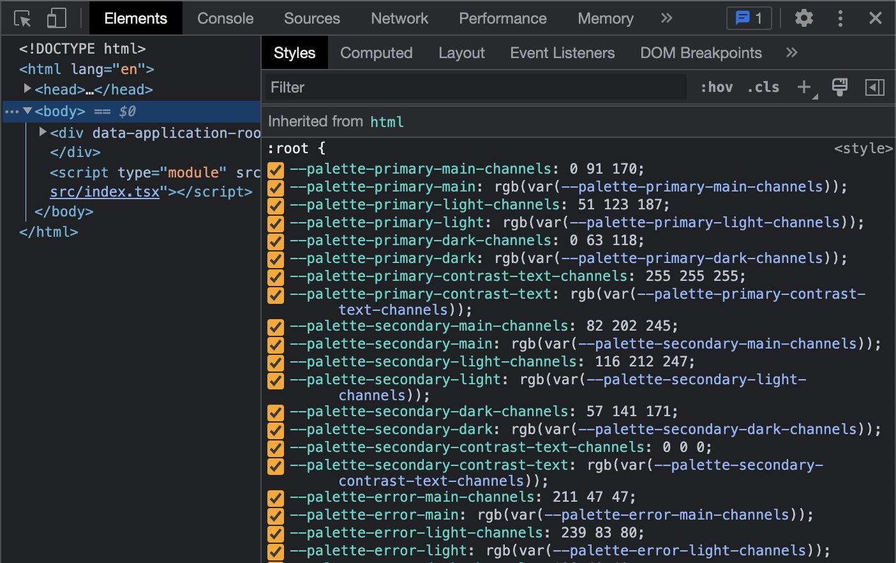
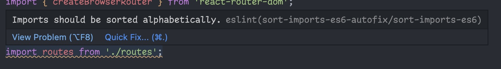
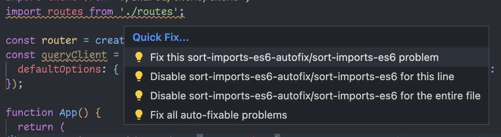
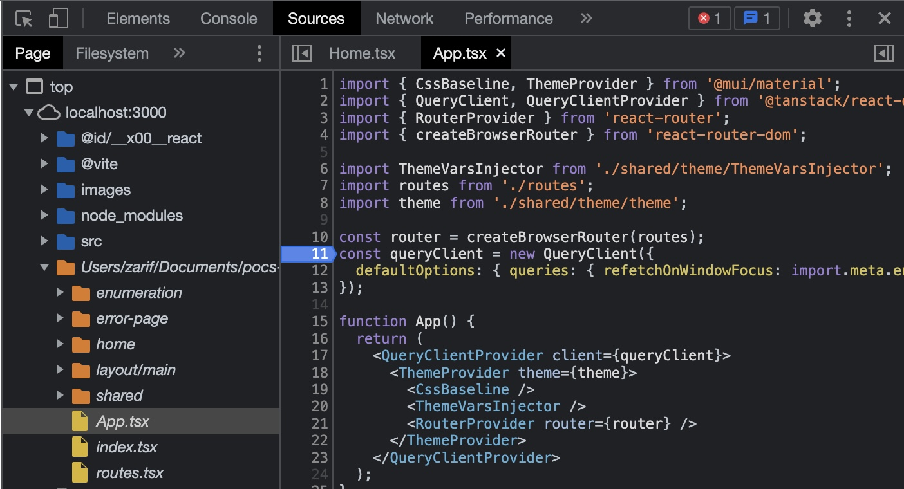

# Schrodinger Hackathon - frontend

The frontend is a [React](https://beta.reactjs.org/) single page application written using [TypeScript](https://www.typescriptlang.org/) and [SCSS](https://sass-lang.com/) and bundled/served using [Vite](https://vitejs.dev/).

For the best development experience we recommend using VSCode as your editor with the pre-configured [development environment](../.devcontainer/devcontainer.json).

## Usage

_All commands mentioned in this README should be executed in the `frontend` directory_

- Install all dependencies

```sh
$> npm install
```

- Start the development server

```sh
$> npm run dev
```

- Lint all files for errors

```sh
$> npm run lint
```

- Bundle a production build

```sh
$> npm run build
```

## Development

This template is provided as a starting point which you can use to build out a complete application. It includes some pre-configured pieces and some tools pre-installed so you can be the most productive with the time you have available.

### Libraries and Frameworks

There are a few libraries and frameworks that we use in this template to help us focus most of our attention on the core implementation of our application's business logic and enable faster prototyping.

#### [React](https://beta.reactjs.org/)

The most fundamental library we are using to construct our UI is React. React enables us to write declarative code with reactive state and allows us to split up our UI in convenient reusable components. Since we're using React you will see that our entire markup is coded using TypeScript with JSX (TSX) instead of HTML. You can learn more about React and JSX [here](https://beta.reactjs.org/learn/describing-the-ui)

#### [Material UI](https://mui.com/) and [SCSS](https://sass-lang.com)

Material UI is the component library we are using to construct our UI elements. Material UI provides a collection of opinionated styled low level components (based on Google's Material Design design system) that we can compose to quickly build out our application UI. In order to provide custom styles to our Material UI React components, we are writing custom styles in SCSS modules. SCSS is a superset of CSS that adds some extra language features to help us write more maintainable CSS. However if you're not familiar with SCSS syntax you can just use plain old CSS since all CSS is perfectly valid SCSS.

Since we are writing styles across multiple different SCSS modules, we are using a feature called [CSS modules](https://github.com/css-modules/css-modules) to locally scope all our class names so we don't run into conflicting classes in different parts of the application. To enable this feature we simply ensure that our SCSS file names end in `.module.scss` and our build system takes care of the rest. To use the scoped class names from our SCSS files in our React components we use the [`classnames`](https://github.com/JedWatson/classnames#alternate-bind-version-for-css-modules) library - you can see examples of this usage in some of our `.tsx` files.

#### [React Router](https://reactrouter.com/en/6.6.1/start/overview)

React Router allows us to use "client side routing" in our application. This means we can associate different pages in our application with different URLs (like a traditional website) without needing to fetch a new document from the server. This lets us preserve local UI state between pages and offers more instant app-like navigation between routes in our application. You can see the existing routes in our application in `src/routes.tsx` and if you need to familiarize yourself with some of the features React Router offers, you can skim this [tutorial](https://reactrouter.com/en/6.6.1/start/tutorial).

### Application Skeleton

The starting point of this template's functionality is an application skeleton that you can develop additional functionality inside. The application skeleton is a basic client rendered React application that uses React Router for client side routing (see details [here](#react-router)).

The entry point for your code will be in `src/routes.tsx` - this module is responsible for defining all routes within the application and includes an existing route for the home page with a primary application layout that renders the sidebar on the left. The recommended way to add more functionality into this application is to add additional routes alongside the home page index route that render the appropriate components (but you should always feel free to deviate from this if you need to!).

The skeleton application is also pre-configured with a Material UI theme and CSS defaults to allow you to compose MUI components to create cohesive views for your application. Since the MUI theme is only constructed and exposed by default on the JS side, the application skeleton also has some code to provide the color palette of the theme via [CSS variables](https://developer.mozilla.org/en-US/docs/Web/CSS/Using_CSS_custom_properties) so you can use them in your styles. You can see all the available CSS variables by opening your browser's devtools in the demo application and inspecting the styles on the `body` tag:



You will notice there are two CSS variables for each theme color, for example `--palette-primary-main` and `--palette-primary-main-channels`. The `channels` variable for a theme color defines the raw red, green, and blue channels for that color while the base variables define the actual CSS color value for that theme color. This is so you can use MUI theme colors with different opacities in your styles. For example:

```css
.my-custom-element {
  border-color: var(--palette-primary-main); // rgb(0 91 170)
  background-color: rgb(var(--palette-primary-main-channels) / 50%); // rgb(0 91 170 / 50%)
}
```

### Editor Experience (VSCode)

_This section only applies if you are using the pre-configured VSCode editor as your development environment_

This template includes some configuration for VSCode that will enable you to develop faster without having to worry about the minutiae of code styling and linting. Additionally, these settings also ensure a consistent code style across projects which will make it easier for the technical volunteers to help you with any troubleshooting if you run into any issues.

The editor is set up to lint and format all of your code on save. We lint our JavaScript/TypeScript code using [ESLint](#eslint) and our CSS/SCSS code using [Stylelint](#stylelint) and all of it is formatted using [Prettier](#prettier). As such, you might see your code change slightly or move around to conform to the settings we have configured for these tools when you save your changes. ESLint attempts to autofix most linting errors that occur but some require either manual intervention from the developer or are offered as suggestions instead of an autofix. You can see details about these errors/warnings by hovering over the red or yellow underlined code and applying the suggested changes from the "Quick Fix" menu (if available).




### Debugging

Regardless of the development environment you are using, one easy way to debug your frontend code is to use the devtools that come bundled with your browser. While your application is open in a browser tab, open the devtools for your browser (this is usually available via `right click -> Inspect Element`). Navigate to the "Sources" or "Debugger" tab inside the devtools. You will find your application files under the absolute path to your `src` directory (it should look something like `workspaces/hackathon-project/frontend/src`). You can now open any module you want to debug and set breakpoints to inspect application state.



Please feel free to ask any of the technical volunteers if you need help with properly debugging your application!

---

## Build system

The build system tooling for an application encapsulates everything from setting up a development environment, tools to enhance development experience all the way to packaging and optimizing an application for production. As such, most developers don't need to dive too deep into how the build system works to contribute code to their application. If you're not planning on making any changes to the pre-configured development environment, you do not necessarily need to read through this section of the documentation. But if you'd like to make changes to your development environment or if you're just curious about things happening under the hood, this documentation should help you get a high level idea of the frontend tooling.

The build system for the frontend relies on the following tools to orchestrate a smooth development experience (these tools are pre-configured for you with sensible defaults but you can always update the configuration to suit your needs):

#### [TypeScript](https://www.typescriptlang.org/)

TypeScript is the language we use to write all of our application code for the frontend. TypeScript is a superset of JavaScript with a strong type system to prevent common errors and encourage exhaustive handling of edge cases. TypeScript has native support in most editors like VSCode which means you can see type-checking output in your editor as you code.

#### [Vite](https://vitejs.dev/)

Vite is the bundler we use to transform and compile all of our separate TypeScript modules into a final production ready JavaScript bundle that can be shipped to a browser. Beyond that, vite also provides us with a server that we can use while developing the application to see our code changes in real time without having to constantly rebuild the application. We also orchestrate type checking and linting during development through the vite development server.

#### [ESLint](https://eslint.org/)

ESLint is a linter (static code analyzer) for JavaScript and TypeScript that can help identify and fix potentially problematic code. It also helps us enforce a consistent code style across the application which can be very helpful when you're working on an team with multiple developers. We've configured ESLint to run alongside our development server so we can see any linting errors in our terminal and browser as we code but you can also run ESLint to lint through the application code manually by running `npm run lint:es` in your terminal. We've also configured VSCode to display and fix lint errors in the editor itself with the help of the [ESLint extension for VSCode](https://marketplace.visualstudio.com/items?itemName=dbaeumer.vscode-eslint).

#### [Stylelint](https://stylelint.io/)

Stylelint is a linter (static code analyzer) for CSS-like syntaxes (SCSS in our case) in the same way that ESLint is a linter for JavaScript and TypeScript. Therefore we use it in much the same way as we use ESLint - it is run alongside our vite development server and you can run it manually by running the command `npm run lint:css` in your terminal. VSCode integration for Stylelint is provided by the [Stylelint extension for VSCode](https://marketplace.visualstudio.com/items?itemName=stylelint.vscode-stylelint).

#### [Prettier](https://prettier.io/docs/en/index.html)

Prettier is an opinionated code formatter for almost all languages used in frontend development like JavaScript, TypeScript, CSS, SCSS, HTML, etc. While prettier doesn't analyze our code for potential errors and bugs like the rest of our toolchain, it helps us enforce consistent stylistic formatting of our code (spaces vs tabs for indentation, character limits on individual lines, single quotes vs double quotes, etc.). By doing this, prettier ensures that the code throughout our application stays predictable and consistent over time. Unlike all of our other tools so far the only way we run prettier on our application files is through the editor via the [Prettier for VSCode extension](https://marketplace.visualstudio.com/items?itemName=esbenp.prettier-vscode) which formats your files every time you save them.
